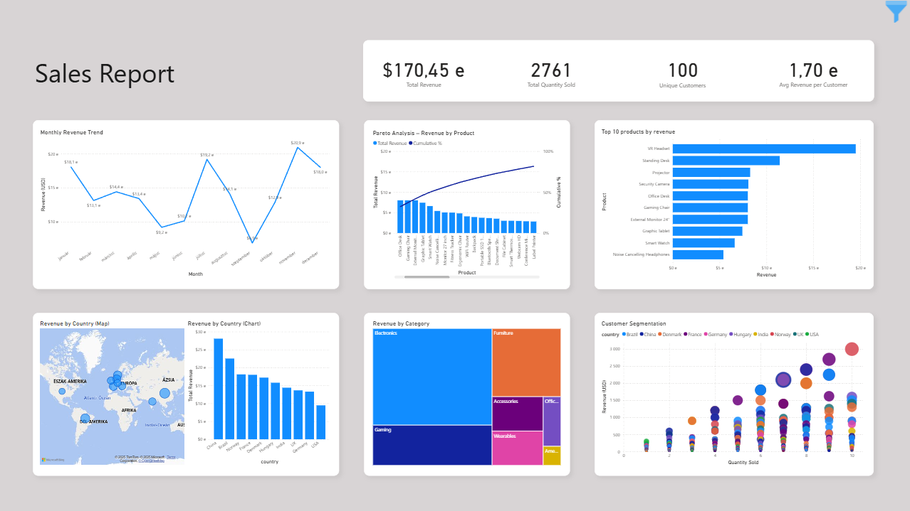

# 🧠 Sales Report Automation with Python

This project demonstrates a full data workflow for sales reporting automation using Python. It includes:

- 📊 Raw data generation (sales)
- 🧹 Data cleaning & merging
- 📈 Excel report generation with pivot tables & formatting
- 📧 Email automation with daily sales report attachment

All components are built to reflect real-world business scenarios such as those handled by data engineers, business analysts, or Excel automation specialists.

---

## 📁 Project Structure

```
Sales-report-automation/
├── data/
│   ├── products.csv
│   ├── customers.csv
│   ├── sales.csv
│   └── cleaned_sales_data.csv
├── output/
│   └── sales_report_YYYY-MM-DD.xlsx
├── scripts/
│   ├── generate_sales_data.py
│   ├── clean_sales_data.py
│   ├── generate_excel_report.py
│   └── send_email_report.py
├── visuals/
│   ├── sales_report_automation.pbix
│   └── dashboard.png
├── reports/
│   └── sales_report.pdf
├── .env.template
├── .gitignore
├── README.md
└── requirements.txt
```

---

## 🛠️ Features

✅ Clean and merge sales data with customer and product info  
✅ Generate pivot tables (by country, product category, top products)  
✅ Export Excel report with formatting using `openpyxl`  
✅ Automatically send report via email using SMTP  
✅ Uses `.env` file to securely store credentials

---

## 📦 Setup Instructions

1. **Clone the repository:**

```bash
git clone https://github.com/yourusername/Sales-report-automation.git
cd Sales-report-automation
```

2. **Install dependencies:**

```bash
pip install -r requirements.txt
```

3. **Create `.env` file:**

Copy `.env.template` and rename it to `.env`. Then add your own credentials:

```
SENDER_EMAIL=your.email@gmail.com
RECEIVER_EMAIL=receiver.email@example.com
APP_PASSWORD=your_app_specific_password
```

💡 *If using Gmail, you must create an [App Password](https://support.google.com/accounts/answer/185833?hl=en) for SMTP access.*

---

## 🚀 Usage

1. **Generate fresh sales data (optional):**

```bash
python scripts/generate_sales_data.py
```

2. **Clean and merge data:**

```bash
python scripts/clean_sales_data.py
```

3. **Generate Excel report:**

```bash
python scripts/generate_excel_report.py
```

4. **Send report by email:**

```bash
python scripts/send_email_report.py
```

Your report will be saved in the `/output/` folder and automatically attached to the email.

---

## 📊 Excel Report Preview

The generated Excel report includes:

- **Sheet 1:** Revenue by Country  
- **Sheet 2:** Revenue by Product Category  
- **Sheet 3:** Top 20 Products by Revenue  

All tables are styled with conditional formatting and column auto-width.

## 📈 Power BI Dashboard

Using the cleaned data, an interactive Power BI report was created with the following Visualizations:

- **Dashboard Overview** – Total revenue, quantity sold, unique customers and average revenue per Customer (KPI cards).
- **Time Series** – Monthly revenue trend analysis.
- **Pareto Analysis** – Revenue by product with cumulative % of revenue (combo chart).
- **Top Products** – Top 10 products by revenue
- **Sales by Country** – Map + bar chart of global revenue distribution.
- **Category Analysis** – Revenue distribution across product categories.
- **Customer Segmentation** – Scatter plot of customers by quantity sold vs. revenue, bubble size as CLV proxy, colored by country.


**Interactivity features:**
- Slicers for date, country, category and product
- Dynamic visuals using DAX measures
- Data types transformed correctly in Power Query
- Drillthrough by country

**Document:**

[`Sales Report`](reports/sales_report.pdf): The final written Sales report as a PDF.

**Preview:**



---

## 🔐 .env and Security

The project uses a `.env` file for sensitive information. This file is **excluded from version control** via `.gitignore`.

If you're sharing this project, you should include a `.env.template` file so others know what variables to define.

---

## 🎯 Use Cases

This project is ideal for:

- Excel automation freelancing (Fiverr / Upwork)
- Data engineering / business analyst portfolios
- Demonstrating Python skills in data cleaning & reporting
- Building automated workflows for clients or teams

---

## 🧠 Skills Demonstrated

- Python (pandas, openpyxl, smtplib)
- Data wrangling and transformation
- Excel automation
- Pivot tables and summaries
- Email automation with attachments
- Interactive data visualization with Power BI.
- Git/GitHub best practices

---

## 📬 Contact
Feel free to open issues or submit pull requests. Questions welcome via GitHub Issues.

## ✅ Author
Created by Gabor Barta

### 💼 Fiverr profile: fiverr.com/gaborbarta1

### 📬 Contact: barta.gabor1992@email.com


